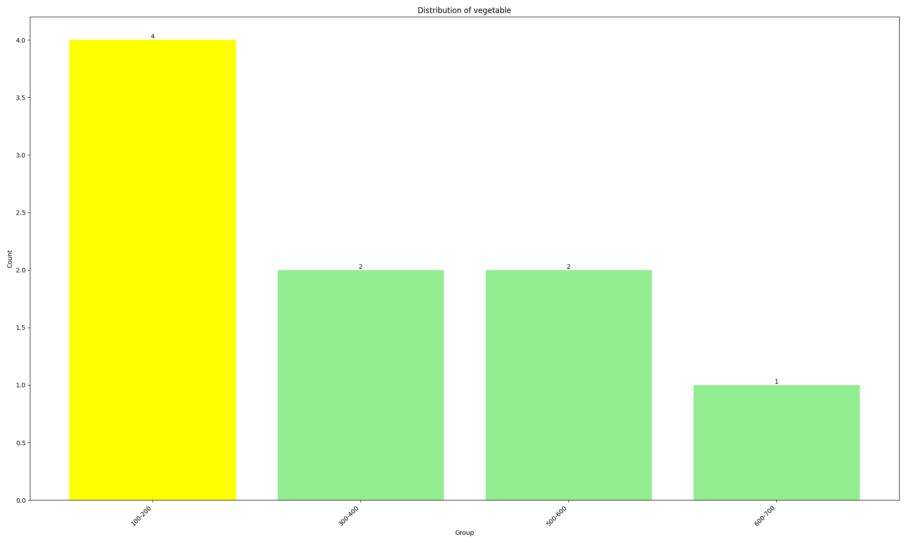
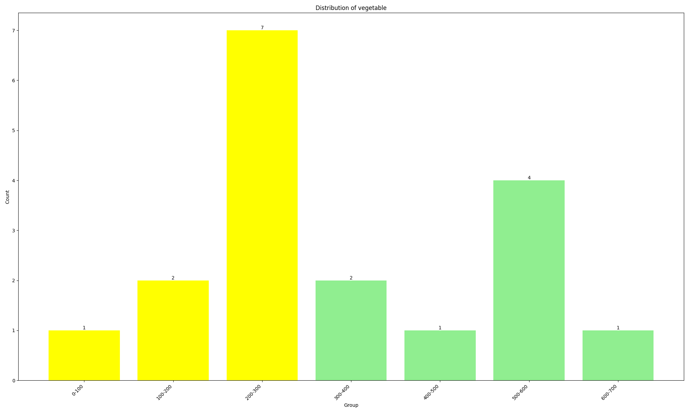
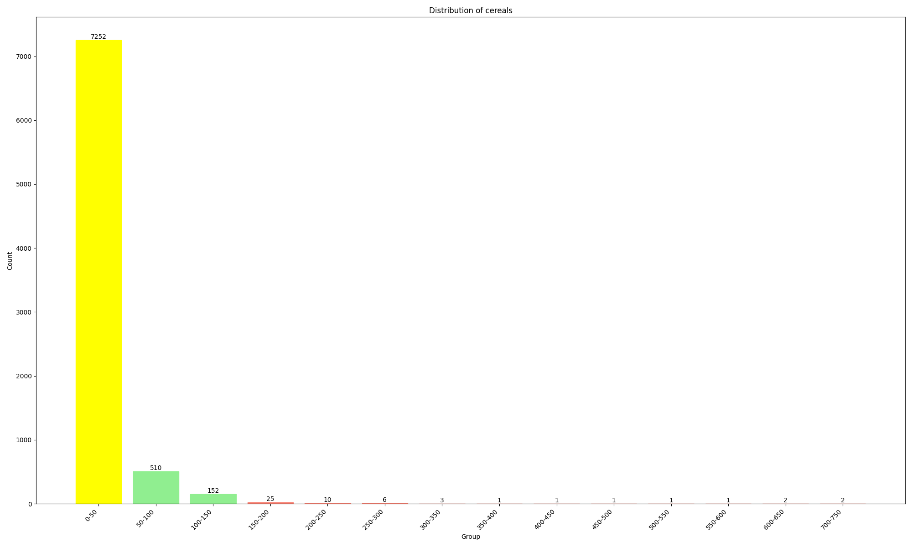
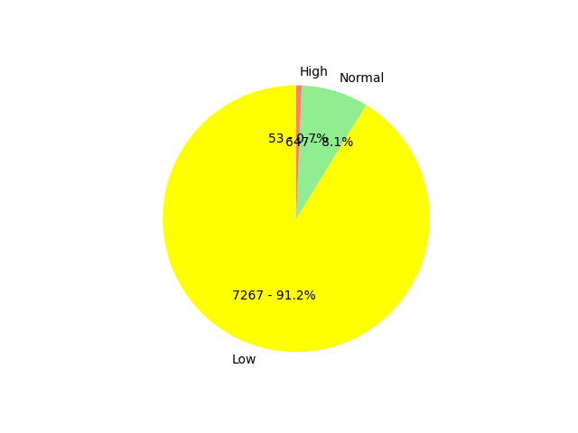
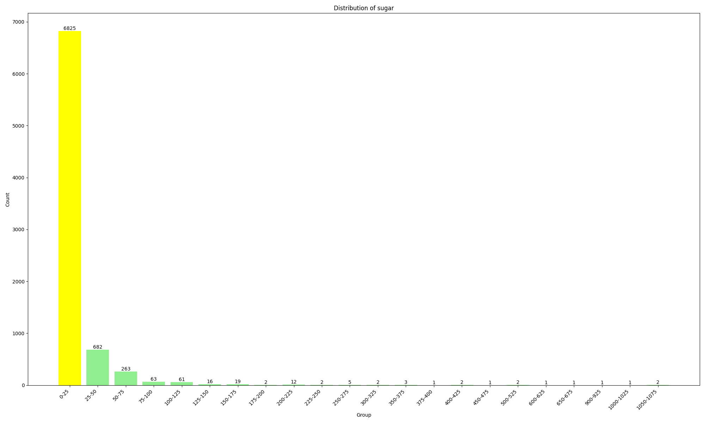

# 黄油小镇之疯狂星期四

[TOC]

## 第一题 & 第四题


### 1.分析题目

​		根据题意可知，为挑食的小子提出建议（保证建议的科学性需参照膳食指南）以及分析各类人群的饮食合理性都是建立在膳食指南的基础上，而且根据膳食指南的各项营养指标也便于我这个脑袋空空的研究员建立一个较为泛化的饮食偏好评估标准。故将第一题和第四题合并

​		基本思路是根据膳食指南，形成饮食偏好的评估标准，根据统计偏好得到的结果（挑食情况）+膳食指南 分析该类人群饮食合理性的同时给出具有指导性和科学性的意见

### 2.解题步骤

#### 2.1划分各类人群

```python
# 筛选出性别为男+汉族+已婚+高学历
class1 = df[(df['性别'] == 1) & (df['民族'] == 1) & (df['婚姻状况'] > 1) & (df['文化程度'] > 4)]
# 筛选出性别为男+汉族+已婚+低学历
class2 = df[(df['性别'] == 1) & (df['民族'] == 1) & (df['婚姻状况'] > 1) & (df['文化程度'] < 4)]
# 筛选出性别为男+汉族+未婚+高学历
class3 = df[(df['性别'] == 1) & (df['民族'] == 1) & (df['婚姻状况'] == 1) & (df['文化程度'] > 4)]
# 筛选出性别为男+汉族+未婚+低学历
class4 = df[(df['性别'] == 1) & (df['民族'] == 1) & (df['婚姻状况'] == 1) & (df['文化程度'] < 4)]
# 筛选出性别为男+少数民族+已婚+高学历
class5 = df[(df['性别'] == 1) & (df['民族'] > 1) & (df['婚姻状况'] > 1) & (df['文化程度'] > 4)]
# 筛选出性别为男+少数民族+已婚+低学历
class6 = df[(df['性别'] == 1) & (df['民族'] > 1) & (df['婚姻状况'] > 1) & (df['文化程度'] < 4)]
# 筛选出性别为男+少数民族+未婚+高学历
class7 = df[(df['性别'] == 1) & (df['民族'] > 1) & (df['婚姻状况'] == 1) & (df['文化程度'] > 4)]
# 筛选出性别为男+少数民族+未婚+低学历
class8 = df[(df['性别'] == 1) & (df['民族'] > 1) & (df['婚姻状况'] == 1) & (df['文化程度'] < 4)]
# 筛选出性别为女+汉族+已婚+高学历
class9 = df[(df['性别'] == 2) & (df['民族'] == 1) & (df['婚姻状况'] > 1) & (df['文化程度'] > 4)]
# 筛选出性别为女+汉族+已婚+低学历
class10 = df[(df['性别'] == 2) & (df['民族'] == 1) & (df['婚姻状况'] > 1) & (df['文化程度'] < 4)]
# 筛选出性别为女+汉族+未婚+高学历
class11 = df[(df['性别'] == 2) & (df['民族'] == 1) & (df['婚姻状况'] == 1) & (df['文化程度'] > 4)]
# 筛选出性别为女+汉族+未婚+低学历
class12 = df[(df['性别'] == 2) & (df['民族'] == 1) & (df['婚姻状况'] == 1) & (df['文化程度'] < 4)]
# 筛选出性别为女+少数民族+已婚+高学历
class13 = df[(df['性别'] == 2) & (df['民族'] > 1) & (df['婚姻状况'] > 1) & (df['文化程度'] > 4)]
# 筛选出性别为女+少数民族+已婚+低学历
class14 = df[(df['性别'] == 2) & (df['民族'] > 1) & (df['婚姻状况'] > 1) & (df['文化程度'] < 4)]
# 筛选出性别为女+少数民族+未婚+高学历
class15 = df[(df['性别'] == 2) & (df['民族'] > 1) & (df['婚姻状况'] == 1) & (df['文化程度'] > 4)]
# 筛选出性别为女+少数民族+未婚+低学历
class16 = df[(df['性别'] == 2) & (df['民族'] > 1) & (df['婚姻状况'] == 1) & (df['文化程度'] < 4)]
```

#### 2.2建立饮食偏好评估标准

按照膳食指南，我们针对新鲜蔬菜、新鲜水果、奶制品、全谷物、大豆制品、鱼禽蛋瘦肉、油炸面食、含糖饮料、盐、酒精、规律进餐等重点指标进行分析

##### 2.2.1新鲜蔬菜指标

指南建议，保证每天摄入不少于300g的新鲜蔬菜，深色蔬菜应占1/2

涉及到表中数据列：新鲜蔬菜食用情况 海带、紫菜等海草类食用情况 而咸菜、泡菜、酸菜不属于新鲜蔬菜，故在此不做考虑

平均每天摄入新鲜蔬菜克重计算：是否吃新鲜蔬菜$\times$(每天食用新鲜蔬菜的频率$\times$平均每次食用量+(每周食用新鲜蔬菜的频率$\times$平均每次食用量)/7+每月食用新鲜蔬菜的频率$\times$平均每次食用量)/30)$\times$50

平均每天摄入深色蔬菜比例计算：(是否吃深色蔬菜$\times$(每天食用深色蔬菜的频率$\times$平均每次食用量+(每周食用深色蔬菜的频率$\times$平均每次食用量)/7+每月食用深色蔬菜的频率$\times$平均每次食用量)/30)$\times$50)/平均每天摄入新鲜蔬菜克重

而在统计过程中，发现深色蔬菜比例有时候会超过100%，说明该调查表中新鲜蔬菜与海带、紫菜等海草类是独立的，后续调研得到，一般来说海带、紫菜等海草类虽然算作是深色蔬菜，但是不属于新鲜蔬菜，故在报告中放弃了对深色蔬菜比例的统计。

```python
pre1=select_data[:,0]*(select_data[:,1]*select_data[:,4]+(select_data[:,2]*select_data[:,4])/7+(select_data[:,3]*select_data[:,4])/30)*50
# 计算深色蔬菜的平均每日摄入量
pre2=(select_data[:,5]*(select_data[:,6]*select_data[:,9]+(select_data[:,7]*select_data[:,9])/7+(select_data[:,8]*select_data[:,9])/30)*50)/pre1
```


**运行结果分析**

**class1**

<div style="display: flex;">
    
    
</div>

从该图中可以看出，新鲜蔬菜摄入量不足与充足的人占比基本一致，该类人群中一半的人不注重蔬菜的摄入，若长此以往，会导致营养不均衡，免疫力下降，消化，心血管等方面的疾病，故应认识到蔬菜的重要性并提高摄入量。

---

**class2**

<div style="display: flex;">
    
    
</div>

从该图中可以看出，该类人群中约60%保持着健康的蔬菜摄入量，但余下的40%的人须提高对的饮食健康的关注程度。身体才是革命的本钱。保证每天摄入不少于300g的新鲜蔬菜。

---

**class3**

<div style="display: flex;">
    
    
</div>

从该图中可以看出，该类人群中新鲜蔬菜摄入量不足和充足的人数之比约为4：3。天平向着不怎么吃蔬菜的人倾斜。该类人群中不爱吃蔬菜的人对蔬菜的不重视有可能被受教育程度影响，他们要改变自己的固有认知，多吃蔬菜以保持健康的体魄。

---

**class4**

<div style="display: flex;">
    
    
</div>

从该图中可以看出，新鲜蔬菜摄入量不足与充足的人占比一致，该类人可能受民族风俗，地理位置，天气条件等的影响不太重视蔬菜的摄入。半数人的饮食习惯不健康，应增加蔬菜的摄入量。

---

**class5**

<div style="display: flex;">
    
    
</div>

从该图中可以看出 ,该类人群中新鲜蔬菜摄入量不足和充足的人数之比约为6:5。饮食习惯不健康的人略多。他们应注意保证每天平均蔬菜摄入量不少于300g。

---

**class6**

<div style="display: flex;">
    
    
</div>

从该图中可以看出，该类人群中新鲜蔬菜摄入量不足和充足的人数之比约为4：5。该类人群可能由于从事相关生产活动的影响，能够保持正常蔬菜摄入量的人略多。但不管怎样，不能因心理的不爱吃蔬菜而影响生理健康。

---

**class7**经统计，无该类人群

---

**class8**

<div style="display: flex;">
    
    
</div>

从图中可以得到的信息是，该类人群的中只有一人，她保持着健康的蔬菜摄入量。

---

**class9**

<div style="display: flex;">
    
    
</div>

从图中可以看出，新鲜蔬菜摄入量不足与充足的人占比基本一致，该类人群中一半的人不注重蔬菜的摄入，若长此以往，会导致营养不均衡，免疫力下降，消化，心血管,皮肤等方面的疾病，故应认识到蔬菜的重要性并提高摄入量。

---

**class10**

<div style="display: flex;">
    
    
</div>

从图中可以看出，新鲜蔬菜摄入量不足与充足的人占比基本一致，该类人群中一半的人不注重蔬菜的摄入。作为新中国的建设者，应重视自己的身体健康，了解膳食平衡，保持正常的蔬菜摄入量。

---

**class11**

<div style="display: flex;">
    
    
</div>

从该图中可以看出，该类人群人数较少的同时新鲜蔬菜摄入量不足与充足的人占比基本一致，该类人群中一半左右的人不注重蔬菜的摄入，若长此以往，会导致营养不均衡，免疫力下降，消化，心血管,皮肤等方面的疾病，故应认识到蔬菜的重要性并提高摄入量。

---

**class12**

<div style="display: flex;">
    
    
</div>

从图中可以看出，新鲜蔬菜摄入量不足的人占比较多。该类人群可能因地理位置，天气条件等原因无法每天摄入一定量的蔬菜。她们应重视自己的身体健康，了解膳食平衡，克服困难，保持300g左右的蔬菜摄入量。

---

**class13**

<div style="display: flex;">
    
    
</div>

从图中可以看出，新鲜蔬菜摄入量不足的人占比较多，但摄入量充足的高学历女性数占比多与同类型低学历女性数占比，也许是被受教育程度差距带来的经济水平差距影响的原因。该类人群可能因地理位置，天气条件等原因无法每天摄入一定量的蔬菜。她们应重视自己的身体健康，了解膳食平衡，克服困难，保持300g左右的蔬菜摄入量。

---

**class14**

<div style="display: flex;">
    
    
</div>

从图中可以看出，新鲜蔬菜摄入量充足的人占比略多。该类人群可能因地理位置，天气条件等原因无法每天摄入一定量的蔬菜。其中摄入量充足的人可能是由于从事相关生产活动的原因。而摄入量不足的人应重视自己的身体健康，了解膳食平衡，克服困难，保持300g左右的蔬菜摄入量。

---

**class15**

<div style="display: flex;">
    
    
</div>

从图中可以看出，新鲜蔬菜摄入量不足与充足的人占比一致，但人数较少。该类人可能受民族风俗，地理位置，天气条件等的影响不太重视蔬菜的摄入。半数人的饮食习惯不健康，应增加蔬菜的摄入量，并将平均摄入量保持在每天300g左右。

---

**class16**

<div style="display: flex;">
    
    
</div>

从图中可以看出，新鲜蔬菜摄入量不足与充足的人占比一致，但人数较少。该类人可能受民族风俗，地理位置，天气条件等的影响不太重视蔬菜的摄入。半数人的饮食习惯不健康，应增加蔬菜的摄入量，保持健康的身体。

---


**由于总共分析了有16种人，而每类人在关于某一项是表上指标上要分析至少一到两张图，并且很多描述都是重复的，为了描述篇幅的考虑，后面的评估将不会把人群进行分类，并且这样做也有其一定的合理性，因为就饮食习惯问题而言，地域性很强，且处于同一地方的人文化背景也相当，将所有人当作一个群体进行统计数据可以避免过多的分类和复杂性，一定程度上会减少统计的误差**

##### 2.2.2新鲜水果指标

保证每天摄入**200~350g**的新鲜水果，果汁不能代替鲜果

平均每天摄入新鲜蔬菜克重计算：

是否吃新鲜水果$\times$(每天食用新鲜水果的频率$\times$平均每次食用量+(每周食用新鲜水果的频率$\times$平均每次食用量)/7+每月食用新鲜水果的频率$\times$平均每次食用量)/30)$\times$50

**运行结果分析**

<div style="display: flex;">
    
    
</div>

从图中可以看出，绝大部分人的每日水果摄入量偏低，约6%的人很爱吃水果，只有约11%的人控制住了寄几。新鲜水果能够促进消化机制对食物所含低微量营养成分的充分吸收、转化和利用。所以居民们应该维护、保持机体这一特有功能，保持身体健康。

##### 2.2.3奶制品

指南建议，吃各种各样的奶制品，最高每日摄入**500**克

平均每天摄入奶制品克重计算：

是否吃鲜奶$\times$(每天食用鲜奶的频率$\times$平均每次食用量+(每周食用鲜奶的频率$\times$平均每次食用量)/7+每月食用鲜奶的频率$\times$平均每次食用量)/30)$\times$50+

是否吃奶粉$\times$(每天食用奶粉的频率$\times$平均每次食用量+(每周食用奶粉的频率$\times$平均每次食用量)/7+每月食用奶粉的频率$\times$平均每次食用量)/30)$\times$10+

是否吃酸奶$\times$(每天食用酸奶的频率$\times$平均每次食用量+(每周食用酸奶的频率$\times$平均每次食用量)/7+每月食用酸奶的频率$\times$平均每次食用量)/30)$\times$50

这里设置

```python
threshold_low = 300 #正常摄入最低克数
threshold_high = 500 #正常摄入最高克数
```

**运行结果分析**

<div style="display: flex;">
    
    
</div>

从图中可以看出，极大部分居民没有吃奶制品的习惯，但有约2%的人非常爱吃奶制品。奶制品对我们的身体又很多益处：镇静安神，促进睡眠，促进智力发育，抵抗衰老，延年益寿，美容皮肤等等。所以居民们应深刻认识奶制品的重要性，吃各种各样的奶制品，但是最高每日摄入500克，保持一个健康的身体。

##### 2.2.4全谷物

指南建议，经常吃**全谷物**。与第四版相比突出全谷物在饮食中的地位

平均每天摄入谷物克重计算：

是否吃大米$\times$(每天食用大米的频率$\times$平均每次食用量+(每周食用大米的频率$\times$平均每次食用量)/7+每月食用大米的频率$\times$平均每次食用量)/30)$\times$50+

是否吃小麦面粉$\times$(每天食用小麦面粉的频率$\times$平均每次食用量+(每周食用小麦面粉的频率$\times$平均每次食用量)/7+每月食用小麦面粉的频率$\times$平均每次食用量)/30)$\times$50+

是否吃杂粮$\times$(每天食用杂粮的频率$\times$平均每次食用量+(每周食用杂粮的频率$\times$平均每次食用量)/7+每月食用杂粮的频率$\times$平均每次食用量)/30)$\times$50

**（薯类不属于全谷物）**

这里设置

```python
threshold_low = 50 #正常摄入最低克数
threshold_high = 150 #正常摄入最高克数
```

**运行结果分析**

<div style="display: flex;">
    
    
</div>

从图中可以看出，黄油小镇的大部分居民不怎么吃谷物，只有极少数每天吃很多谷物类食品。谷物食品中的丰富碳水化合物能提供人体所需的能量，也是B族维生素、矿物质、膳食纤维和蛋白质的重要食物来源，在保证儿童生长发育和人体健康方面发挥着重要作用。谷物的高膳食纤维含量是久坐家庭膳食纤维的良好来源和非常精细的饮食，这有利于预防肥胖、便秘和慢性疾病的风险。所以居民们应尽量经常吃全谷物！

##### 2.2.5大豆制品

指南建议，经常吃大豆制品

平均每天摄入大豆制品克重计算：

是否吃豆腐$\times$(每天食用豆腐的频率$\times$平均每次食用量+(每周食用豆腐的频率$\times$平均每次食用量)/7+每月食用豆腐的频率$\times$平均每次食用量)/30)$\times$50+

是否吃豆腐丝\千张\豆腐干$\times$(每天食用豆腐丝\千张\豆腐干的频率$\times$平均每次食用量+(每周食用豆腐丝\千张\豆腐干的频率$\times$平均每次食用量)/7+每月食用豆腐丝\千张\豆腐干的频率$\times$平均每次食用量)/30)$\times$50+

是否吃豆浆$\times$(每天食用豆浆的频率$\times$平均每次食用量+(每周食用豆浆的频率$\times$平均每次食用量)/7+每月食用豆浆的频率$\times$平均每次食用量)/30)$\times$50+

是否吃干豆类$\times$(每天食用干豆类的频率$\times$平均每次食用量+(每周食用干豆类的频率$\times$平均每次食用量)/7+每月食用干豆类的频率$\times$平均每次食用量)/30)$\times$50

这里设置

```python
threshold_low = 30 #正常摄入最低克数
threshold_high = 50#正常摄入最高克数
```

**运行结果分析**

<div style="display: flex;">
    
    
</div>

从图中可以看出，黄油小镇里有60%的人热衷于吃大豆制品，也有约30%的小子摄入量不足。豆制品含有丰富的植物蛋白、钙、磷、铁、纤维素等，总体来说对人体有益。但是，豆制品吃太多也会对身体有害。主要表现在以下几个方面：豆制品含有丰富的植物蛋白、钙、磷、铁、纤维素等，总体来说对人体有益。但是，豆制品吃太多也会对身体有害。主要表现在以下几个方面：促使肾功能衰退，引起消化不良，促使动脉硬化形成，导致碘缺乏，促使痛风发作，增加胃肠道负担。所以挑食的小子们应该把每日豆制品摄入量控制在正常范围内。

##### 2.2.6鱼禽蛋瘦肉

指南建议，鱼禽、蛋类和瘦肉摄入要适量，平均每天120~200g

平均每天摄入鱼禽蛋瘦肉克重计算：

是否吃猪肉类$\times$(每天食用猪肉类的频率$\times$平均每次食用量+(每周食用猪肉类的频率$\times$平均每次食用量)/7+每月食用猪肉类的频率$\times$平均每次食用量)/30)$\times$50+

是否吃牛、羊肉$\times$(每天食用牛、羊肉的频率$\times$平均每次食用量+(每周食用牛、羊肉的频率$\times$平均每次食用量)/7+每月食用牛、羊肉的频率$\times$平均每次食用量)/30)$\times$50+

是否吃禽肉$\times$(每天食用禽肉的频率$\times$平均每次食用量+(每周食用禽肉的频率$\times$平均每次食用量)/7+每月食用禽肉的频率$\times$平均每次食用量)/30)$\times$50+

是否吃内脏类$\times$(每天食用内脏类的频率$\times$平均每次食用量+(每周食用内脏类的频率$\times$平均每次食用量)/7+每月食用内脏类的频率$\times$平均每次食用量)/30)$\times$50+

是否吃蛋类$\times$(每天食用蛋类的频率$\times$平均每次食用量+(每周食用蛋类的频率$\times$平均每次食用量)/7+每月食用蛋类的频率$\times$平均每次食用量)/30)$\times$60

**运行结果分析**

<div style="display: flex;">
    
    
</div>

从图中可以看出，黄油小镇里吃禽蛋肉类多、少、正常的居民各占30%左右。禽蛋肉类的好处包括提供丰富的蛋白质和营养物质，具有防癌作用。然而，过多摄入可能增加胆固醇和脂肪摄入，增加心脑血管疾病和肥胖的风险。

##### 2.2.7油炸面食、食用油

指南建议，培养清淡饮食习惯，少吃高盐、高糖和油炸食品。成人每天摄入烹调油**25~30**克。根据世界卫生组织发布的《全球食品安全标准》和《全球膳食指南》，专家推荐的每人每天摄入油炸食品的量不超过25克。

但是表中给的每家平均每月食用油的统计

如何估算每家平均有多少人是个问题，我觉得这算是问卷设置的问题，并且其中同一家庭的成员也可能重复填写问卷，故难以计算平均每天个人摄入食用油克重

但是我们可以以家庭为单位，从一些数据库查询得到一般家庭平均每月食用油的使用情况，据此完成统计（这里同一家庭的成员重复填写问卷的情况也无法修正，不知道学长学姐们还有什么更好的建议嘛）

这里设置一般家庭的平均每月食用油斤数为：3斤-6斤

平均每月每户摄入食用油斤数计算：植物油每月斤数+动物油每月斤数

**运行结果分析**

<div style="display: flex;">
    
    
</div>

黄油小镇里有60%的人热衷于吃高油及油炸类食品，只有约16%的小子有健康的饮食习惯。长期摄入高油食品可能增加患高血压、心血管疾病、肥胖、代谢疾病、胃癌和骨质疏松等疾病的风险。为了保持健康，建议适度控制高油食品的摄入量。

##### 2.2.8含糖饮料

指南建议，不喝或少喝含糖饮料，成人每天控制添加糖在25克以下。也督促大家不要口渴时
才喝水，要少量多次、足量饮水。推荐喝白水或茶水，少喝或不喝含糖饮料，不用饮料代替
白水

假设一般饮料的平均含糖克重比例为10%

平均每天摄入含糖饮料克重计算：

（是否吃果汁饮料$\times$(每天食用果汁饮料的频率$\times$平均每次食用量+(每周食用果汁饮料的频率$\times$平均每次食用量)/7+每月食用果汁饮料的频率$\times$平均每次食用量)/30)$\times$250+

是否吃其他饮料$\times$(每天食用其他饮料的频率$\times$平均每次食用量+(每周食用其他饮料的频率$\times$平均每次食用量)/7+每月食用其他饮料的频率$\times$平均每次食用量)/30)$\times$250）$\times$0.1

**运行结果分析**

<div style="display: flex;">
    
    
</div>

黄油小镇里有约86%的人每日糖分摄入量不足。每日糖分摄入量不足可能导致低血糖、缺乏能量、脑功能受损、注意力下降、情绪波动等问题。因此，保持适量的糖分摄入对于维持身体健康非常重要。为了维持身体健康，建议保持适当的饮食平衡，包括摄入足够的碳水化合物，以确保身体获得足够的能量和糖分供应。然而，过量摄入糖分也可能导致肥胖、糖尿病和其他健康问题，因此需要保持适度。个体的营养需求因年龄、性别、生活方式和健康状况而异，最好在专业医生或营养师的指导下制定合适的饮食计划。

##### 2.2.9盐

指南建议，成人每日食盐摄入量控制在5克以内

这里设置一般家庭的平均每月摄入盐的克重为：300g-450g

平均每月每户摄入盐克重计算：盐$\times$50

**运行结果分析**

<div style="display: flex;">
    
    
</div>

从图中可以看出，黄油小镇的居民里约60%的人每日食盐摄入量控制在正常水平，约40%的人摄入量低于正常水平。适量的盐摄入对于人体的正常功能和健康非常重要，因为盐中的钠离子在维持体液平衡、神经传导、肌肉收缩等方面起着重要作用。然而，如果吃盐量不足，可能会导致低血压，肌肉痉挛，电解质失衡，甲状腺问题等。因此，保持适量的盐摄入是维持健康的关键。

##### 2.2.10酒精

指南建议，成人每日摄入酒精应少于**15克**，特殊人群不应饮酒

各种酒含酒精比例

| 高度白酒 | 低度白酒 | 啤酒 | 黄酒、糯米酒 | 葡萄酒 |
| -------- | -------- | ---- | ------------ | ------ |
| 0.45     | 0.25     | 0.05 | 0.15         | 0.1    |

平均每日摄入酒精克重计算：

(是否饮用高度白酒$\times$饮用频率$\times$平均每次饮用量$\times$0.45+

是否饮用低度白酒$\times$饮用频率$\times$平均每次饮用量$\times$0.25+

是否饮用啤酒$\times$饮用频率$\times$平均每次饮用量$\times$0.05+

是否饮用黄酒、糯米酒$\times$饮用频率$\times$平均每次饮用量$\times$0.15+

是否饮用葡萄酒$\times$饮用频率$\times$平均每次饮用量$\times$0.1)/7$\times$50

**运行结果分析**

<div style="display: flex;">
    
    
</div>

从图中可以看出，黄油小镇的居民大部分都不怎么喝酒，并且居民里几乎没有过量饮酒的人，给他们点赞！过量饮酒可能对身体的多个方面造成危害，包括肝脏、心血管系统、精神和情绪、性功能、生殖系统等。因此，建议保持适量的饮酒，避免过量饮酒对身体健康造成不良影响。

##### 2.2.11规律进餐

指南建议，规律进餐、适度饮食，不暴饮暴食、不偏食挑食、不过度节食

**不吃早餐情况**

<div style="display: flex;">
    
    
</div>

很遗憾，黄油小镇只有约20%的人在意吃早餐这件事。不吃早餐可能会对身体产生一些危害，如：消化问题，大脑功能受损，胆固醇增高，胆结石，发胖，便秘问题等。小子们，为了身体健康，一定要对早餐重视起来呀！

**不吃午餐情况**

<div style="display: flex;">
    
    
</div>

午餐可以给身体提供非常多的能量，但黄油小镇的居民的午餐摄入情况却不是很乐观，只有约1%的人的摄入量是充足的。不吃午餐会对身体健康产生一定的危害，包括对大脑、消化系统和营养摄入的影响。因此，建议保持规律的饮食习惯，合理安排三餐，确保身体获得足够的营养和能量。

**不吃晚餐情况**

<div style="display: flex;">
    
    
</div>

从图中可以看出，黄油小镇的居民也不怎么重视晚餐，饮食习惯非常不好！长期不吃晚餐可能会对身体产生一些危害，如：抵抗力下降，肠胃受损，影响大脑功能，容易患胆结石，容易低血糖等。为了保持健康，建议晚餐要适量、均衡，并选择营养丰富的食物。指南建议，规律进餐、适度饮食，不暴饮暴食、不偏食挑食、不过度节食。

## 第二题


### 1.分析题目

因为很多统计工作，步骤都是差不多的，所谓这里为了节省篇幅，只对男女两类人的吸烟情况进行分析

男-是否吸烟-吸烟量

女-是否吸烟-吸烟量

针对吸烟情况，我采用吸烟指数作为参考。首先，根据年龄和开始吸烟年龄计算出烟龄。对于填写“记不清”的样本，我们假设其开始吸烟年龄为中国居民平均开始吸烟年龄19岁。其次，计算出平均每日吸烟支数。最后，两者相乘得到计算出吸烟指数。计算方法如下：

​														**吸烟指数 = 烟龄 $\times$ 平均每日吸烟支数**

吸烟指数≤200为轻度吸烟，200-400为中度吸烟，≥400为重度吸烟

### 2.求解分析

#### 2.1 男性吸烟情况

计算男性吸烟指数

烟龄= 2023-出生年-开始吸烟年龄

(是否吸烟$\times$平均每周吸烟天数$\times$一天吸烟支数)/7$\times$烟龄

**运行结果分析**

<div style="display: flex;">
    
    
</div>

从图中可以看出，黄油小镇的男性中约有20%非常爱吸烟，约有70%的人不怎么吸烟。男性吸烟的危害包括对健康的影响、生殖系统的影响以及对后代的影响。为了保护自己的健康和他人的健康，建议男性尽量避免吸烟或戒烟。

#### 2.2 女性吸烟情况

烟龄= 2023-出生年-开始吸烟年龄

计算女性吸烟指数

(是否吸烟$\times$平均每周吸烟天数$\times$一天吸烟支数)/7$\times$烟龄

**运行结果分析**

<div style="display: flex;">
    
    
</div>

从图中可以看出，黄油小镇的女性中几乎没有人过量吸烟，非常棒！女性吸烟的危害包括肺癌和呼吸系统疾病、心血管疾病、癌症风险增加、生育问题、皮肤和外貌问题以及其他健康问题。因此，强烈建议女性避免吸烟，保持健康的生活方式。

## 第三题


### 1.分析题目

对于相关性的研究，只是在高中学习概率那部分知识的时候接触过，什么线性回归方程、卡方检验

查询资料得知，卡方检验一般用于探究两个分类变量之间的关联性，而不是一个变量与多个变量之间的关联性，还有其他相关性分析方法，比如皮尔逊相关系数和斯皮尔曼秩相关系数，而在Pandas库中，DataFrame的`corr()`函数用于计算列之间的相关系数。`corr()`函数默认使用皮尔逊相关系数，也可以选择使用斯皮尔曼秩相关系数。相关性系数的范围在-1到 1之间-1表示完全负相关，1 表示完全正相关，0表示无相关性。

因为主要使用的研究方法类似，这里就只挑选了一种慢性病-高血压，作为主要的研究对象，分析“饮食”因素时只选取一类（食用油摄入情况）参与相关性检验、吸烟参考吸烟指数、饮酒参考日均摄入克重、运动参考日均锻炼强度$\times$锻炼时间、工作参考“职业”数据

### 2.预处理数据

将涉及到的数据进行处理

形成列名为"是否患高血压" "食用油摄入" "吸烟指数" "日均饮酒量"  "日均运动量"  "职业"的df数据


### 3.运行结果分析

这个使用皮尔逊相关系数

各项因素与高血压之间的相关系数热图如下：


从热力图可以观察到一些有趣的相关性结果。高血压与体育运动负相关，且负相关程度最高，这意味着体育运动可能不是高血压问题的主要因素。与吸烟负相关，这可能表明吸烟习惯与高血压之间的关联性不太显著。然而，与摄入酒精量正相关，这可能暗示饮酒对高血压有一定的影响。

最引人注意的是，高血压与食用油摄入量正相关程度最高，这可能意味着饮食中的油脂摄入可能与高血压之间存在一定的关系。这个发现可能需要更详细的研究来确定是否存在因果关系，以及如何调整饮食以降低患高血压的风险。

综上所述，这些相关性结果提供了一个初步的了解，但仍需要进一步的研究来确认这些关系，以便更好地指导黄油小镇的健康政策和黄油小镇居民的生活习惯。

## 反思与总结

在进行建模的过程中，仍然有很多不准确的地方，比如食用油的统计，缺乏一些关于家庭人口的数量难以准确描述食用油的摄入情况，虽然这个问题可以归结到调查问卷设计不合理上，但是我们不能苛责过分别人，可以反过来要求一下自己：**怎么在已知有限的情况下尽可能推知全貌**，我想，这也是数学建模的乐趣所在

在完成题目的过程中，我其实有点想关注个体，就是形成对一个人的饮食情况等信息进行建模，制定更加个性化的方案。我现在对于机器学习的知识了解不多（可以算是只是有一个直观理解仅此而已），但是我觉得可以利用机器学习的推荐系统，输入一个人的饮食习惯、健康状况，结合自己的喜好+膳食指南，为个人推荐食谱、推荐较为健康的生活方式等等，只是一些直观上的想象。

还有对相关系数的概念，只能说是一个浅层的理解，我只是调用了一个现成的函数，对于其原理的理解，我打算之后去看看概率论与数理统计的相关知识来充分了解它的底层实现。

## Git 与 GitHub

https://zhuanlan.zhihu.com/p/337959303?utm_psn=1702085440361005056 已参考该教程，完成代码上传，并掌握了基础的Git操作和可视化管理Git。

## 我到底通关了没

关于这一题，我是觉得比较简单的，利用现有的前端框架，可以很好地解决问题，可能我现在不懂具体如何解决，但是我相信这个在自学之后应该是好上手的，相比之下，我更喜欢做实际的数据处理

## 看看你的

这道题应该很有意思，虽然我最近时间比较紧张，但是我对网络爬虫很有兴趣（听说还可以用爬虫写抢课脚本（bushi)），可能就是窥私欲这种本能吧，而且感觉网络爬虫也是大多数据分析工程的基础。
## 遇到的困难

### 1.编程语言的选择

​	就目前课程而言，我们学的是C语言，但是经过调研，我发现`python`语言更适合用于数据处理与分析，因此前几天都在配置`python`环境、自学`python`，主要针对`pandas`库、`matplotlib`库和`numpy`库学习基本操作，因此对于`python`的一些特性、基本知识虽然不是很熟悉，但至少可以用起来

### 2.报错处理

​	在编写程序的过程中，令我感触最深的是，因为没有打好`python`的基础，导致报错很多，尤其是关于类型（元组、列表、字典、整形等类型）的报错，基于报错的信息，再补充我那缺失的基础知识

​	在处理报错时，我慢慢学会了如何使用`vscode`编辑器进行调试，设置断点、单步运行等等，定位发生错误的地方，然后搜索解决方法

​	在理解报错信息的过程中，我使用最多的语句就是以下的两个语句，以此来搞懂产生错误的原因

```python
print(某个变量)
print(type(某个变量))
```

### 3.理清编程的逻辑

​	刚开始对于如何实现数据处理还是一头雾水，因为不太理解函数封装的思想，就去看了相关部分的`python`技术书籍，才慢慢地将流程化的步骤实现为`python`的函数，之后在后续的部分调用

## 期望

这里是我的github账号截图(难蚌hhh)未来，我会尽力让它变得越来越绿的！
虽然我刚刚接触编程，很多语句用不熟悉，但是我一定会多加练习的，请学长学姐给我一个可以实践的机会！


